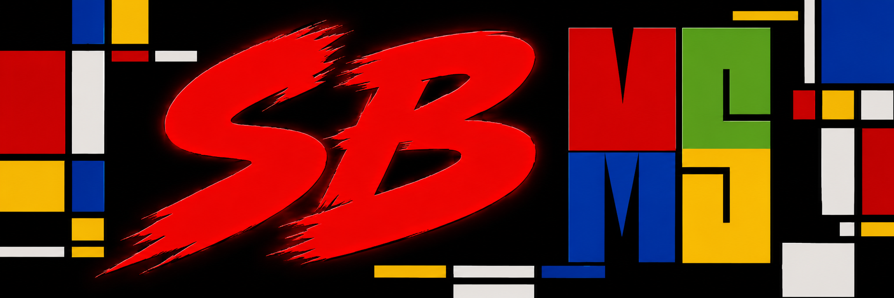

# SBMS

[English](README.md)

'SBMS' stands for "SBMS bridges multiple screens", Microsoft is a great company and Windows is a good system. (BTW I use Linux for laptop XD)
'SBMS'的意思是SBMS连接多个显示器, 微软是一家伟大的公司, win是一个很棒的操作系统. (顺带一提我的笔记本装了企鹅系统(doge))

'SBMS' 的初衷是补全windows多屏协作系统下默认逻辑桌面拓扑关系和显示器物理尺寸的计算规则. 

'SBMS' 通过把一个(或多个) Windows 虚拟桌面全屏映射到指定的物理显示器来实现。当 Windows
自带的扩展或复制模式无法满足分辨率、缩放比例或桌面布局需求时，可以用它
建立一条独立的显示链路。

从托盘中选择物理显示器并开始映射后，SBMS 会：

- 按配置的尺寸和刷新率创建虚拟显示器；
- 把目标显示器上的普通窗口迁移到虚拟桌面；
- 将虚拟桌面映射回目标显示器；
- 把鼠标输入转发给虚拟桌面上的 Windows 真实指针；
- 停止时恢复窗口和原来的物理显示布局。

映射运行期间新出现的窗口也会被迁移。按 **F8** 可以释放鼠标捕获。

## 实现

应用程序和生命周期逻辑使用 Rust。一个很小的 C++ UMDF 间接显示驱动通过
WDF/IddCx 向 Windows 提供虚拟显示器。镜像链路使用 Desktop Duplication
和 D3D11 着色器，全程留在 GPU 上，并包含面积缩放和轻量的子像素彩边抑制。

托盘控制面板使用 Slint，安装和升级使用 Inno Setup。

实现细节见[架构说明](docs/architecture.md)。GUI 开发可参考
[尺寸计算接口](docs/geometry.md)和[多组映射接口](docs/mapping-plan.md)。

## 安装和使用

1. 从最新 GitHub Release 下载 `SBMS-Setup-1.2.0-x64.exe`。
2. 运行安装包并批准管理员权限。
3. 从系统托盘打开 SBMS，选择目标显示器，然后点击 **Start**。
4. 断开或重新排列显示器前，先点击 **Stop**。

SBMS 会随安装用户登录自动启动。可在 Windows“已安装的应用”中卸载，
卸载器会同时移除驱动和自启动任务。

当前安装包使用本地测试证书签名。驱动加载前，Windows 必须信任该证书，
或者启用测试签名模式。要让普通用户无需额外设置即可安装，仍需使用微软认可
的生产驱动签名。

## 命令行

日常使用建议通过托盘完成。管理员终端中也可以使用相同的生命周期：

```powershell
sbms list
sbms map --target '<monitor-device-path>'
sbms plan validate examples\two-streams.json
sbms plan run examples\two-streams.json
sbms config show
sbms shutdown
```

`sbms list` 会列出 `--target` 所需的稳定显示器 ID。前台运行 `map` 时按
Enter，可以正常停止并完成恢复。映射计划最多可混合八组本地镜像和纯串流
虚拟桌面；当前托盘 UI 仍只使用其中一组。

## 构建

需要 Rust、Visual Studio C++ Build Tools、匹配的 Windows Driver Kit、
Inno Setup 6 和代码签名证书。

```powershell
cargo build --release
.\build-driver.ps1 -SigningCertificateThumbprint <thumbprint>
.\build-installer.ps1 -SigningCertificateThumbprint <thumbprint>
```

安装包输出到 `target\installer`。

## 致谢
这是我第一个公开发布的 GitHub 项目，希望对您有所帮助。
感谢我的所有朋友，尤其是Jerry和Tony，他们与我分享了他们的想法和建议。感谢我的CSA老师Mr Berti。感谢我的父母对我的支持。感谢住在美国的老哥帮我充值了我的OpenAI订阅。感谢Tibo为我重置了额度。感谢所有将我的想法落地的代理和子代理们。
